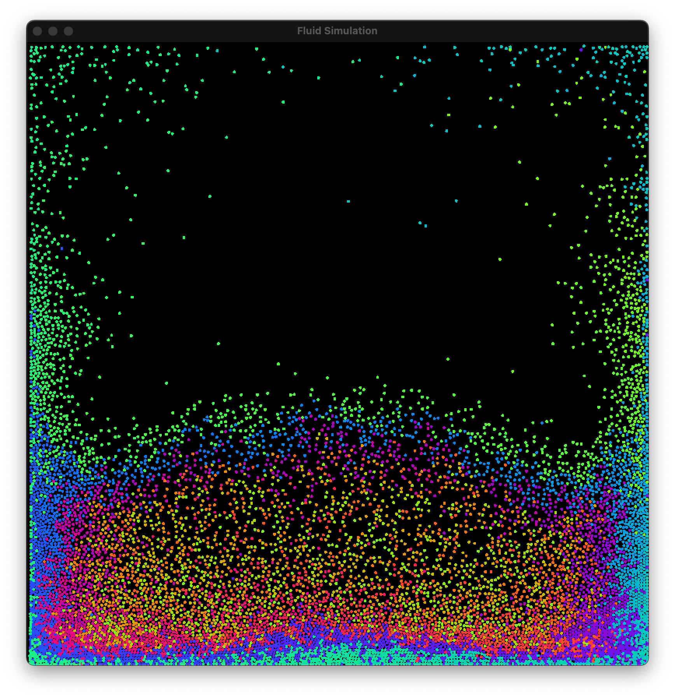

# Particle Simulation

A fast, parallel particle simulation engine built in C++ using SFML and OpenMP. This project simulates the physical interactions between thousands of circular particles under gravity, with support for collision detection, spatial partitioning, and simple fluid-like behavior.

With -O3 compiler flag I could simulate 10000 particle at around **~90** FPS on my laptop (8 core (4 power + 4 efficiency)).

<p align="center">
  
</p>


## Features

- **Structure of Arrays (SoA)**: Improves memory access patterns (by better taking advantage of CPU caching) and SIMD-friendliness over traditional AoS (Array of Structures).
- **Multithreading**: Uses OpenMP to parallelise physics and collision processing loops wherever possible for scalability on multicore CPUs.
- **Spatial Hash Grid**: Grid-based spatial partitioning enables fast neighborhood queries with bounded complexity.
- **Real-time Rendering**: Leverages [SFML](https://www.sfml-dev.org/) for simple and fast 2D graphics.
- **Friction & Cohesion**: Models tangential velocity damping to mimic "sticky" or "fluid-like" particle interactions. (To be implemented)

## Getting Started

### Prerequisites

- C++17 or newer
- [SFML 2.5+](https://www.sfml-dev.org/)
- [CMake 3.15+](https://cmake.org/)
- OpenMP (via `libomp` on macOS)

### macOS Setup

```bash
brew install sfml libomp

### Build
git clone https://github.com/ranjit002/FluidSim.git
cd FluidSim/build
cmake -DCMAKE_BUILD_TYPE=Release .
make
./fluidsim